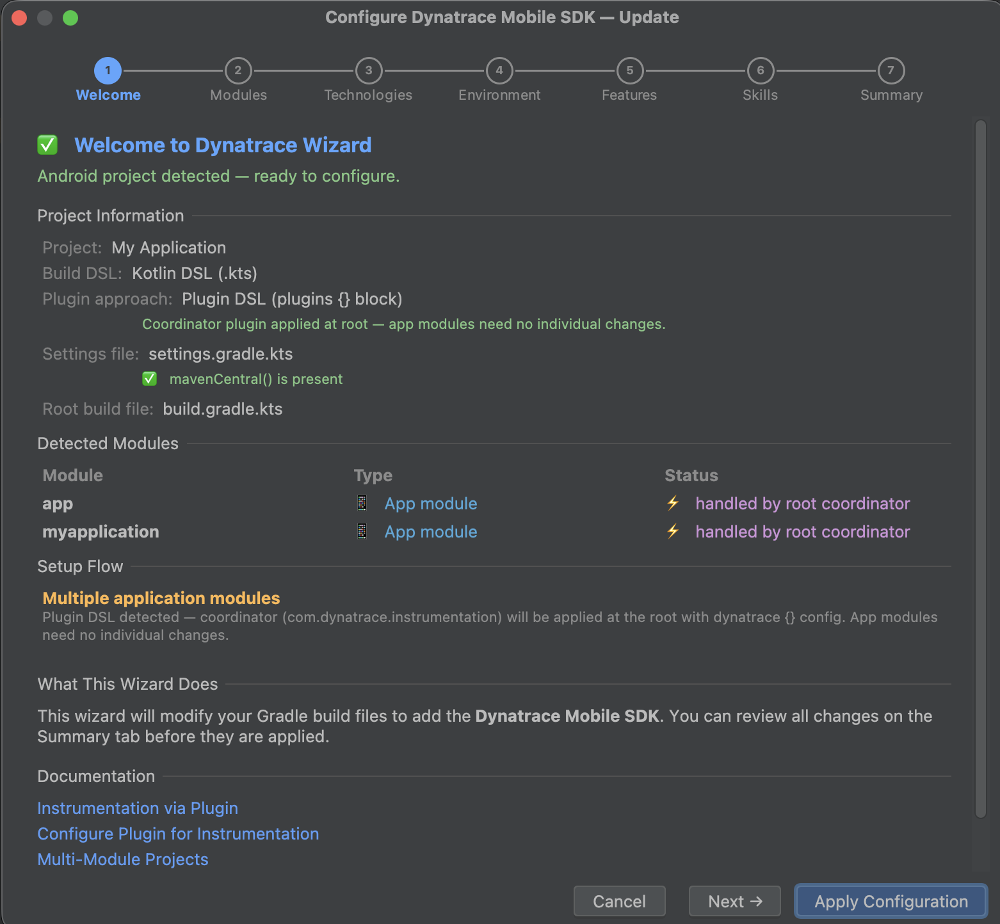
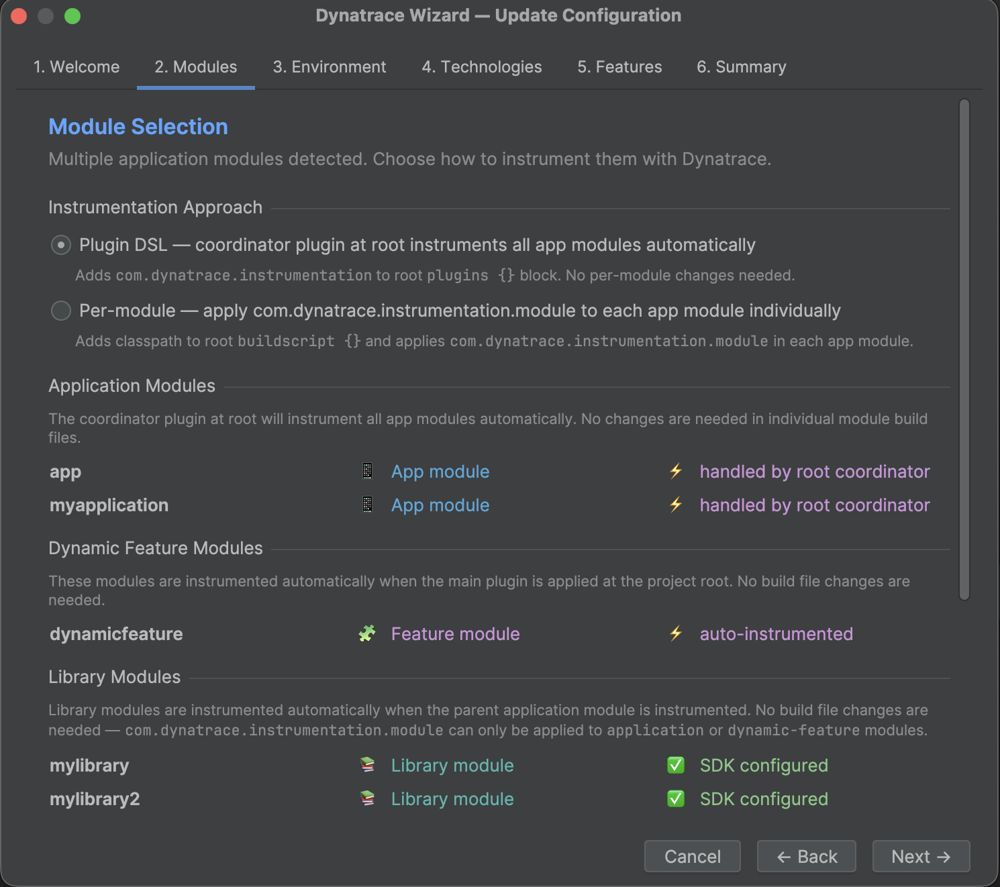
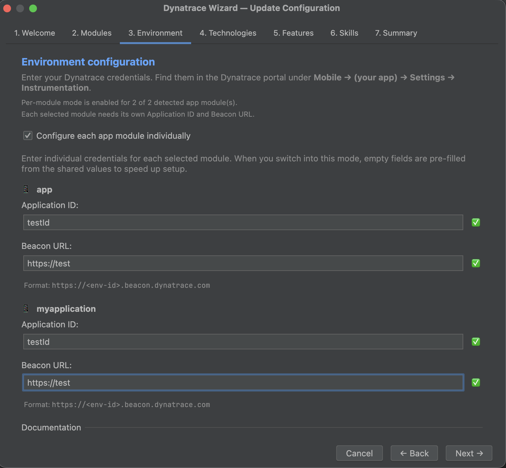
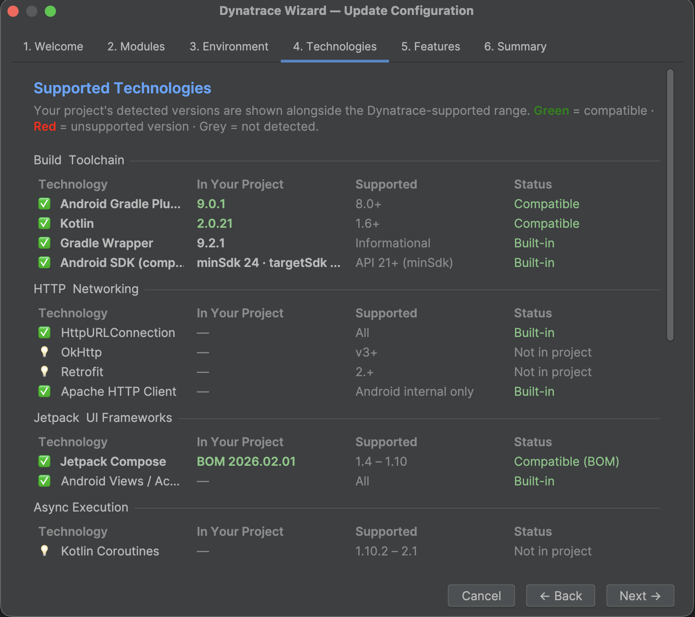
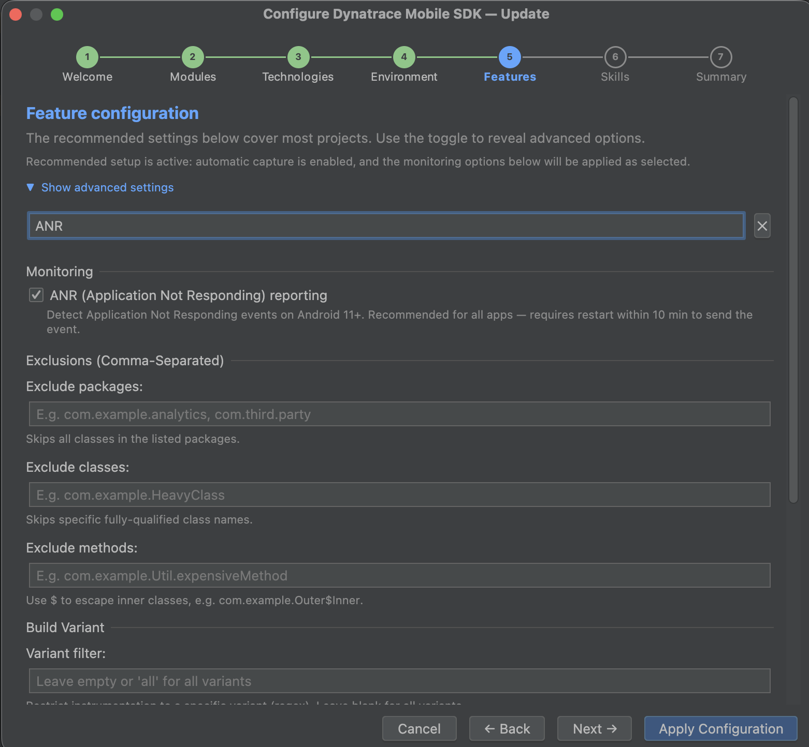
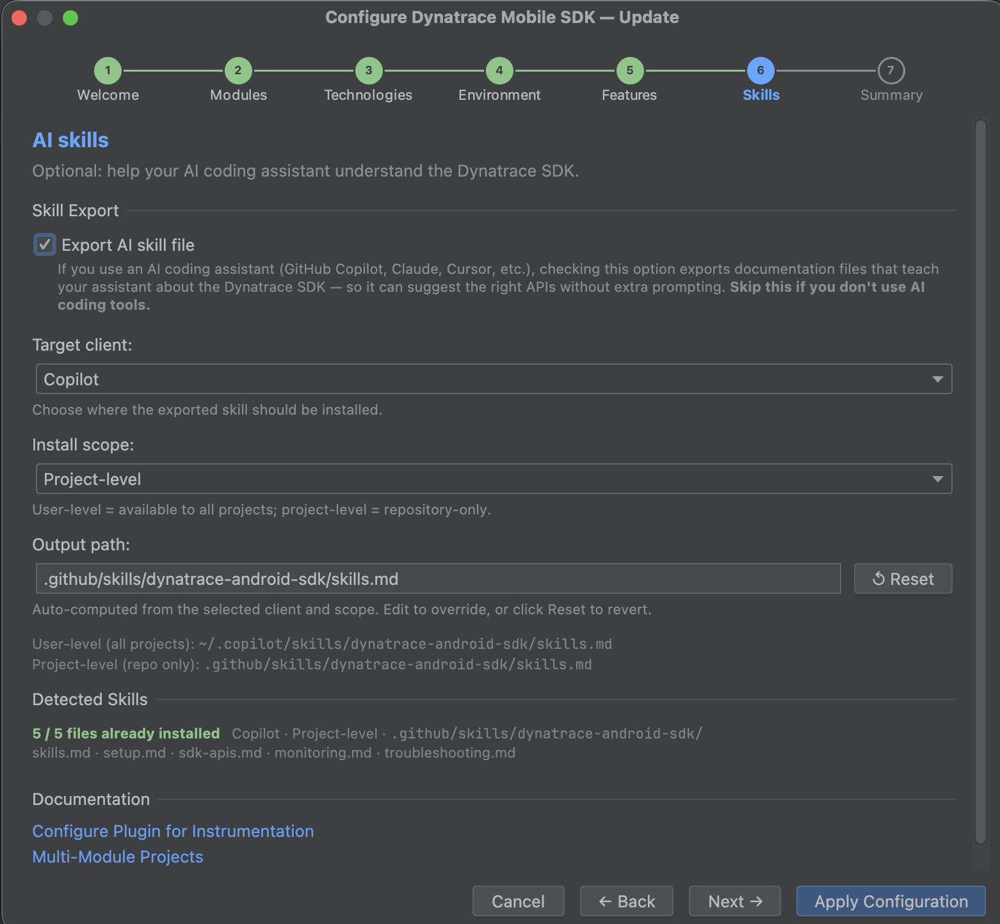
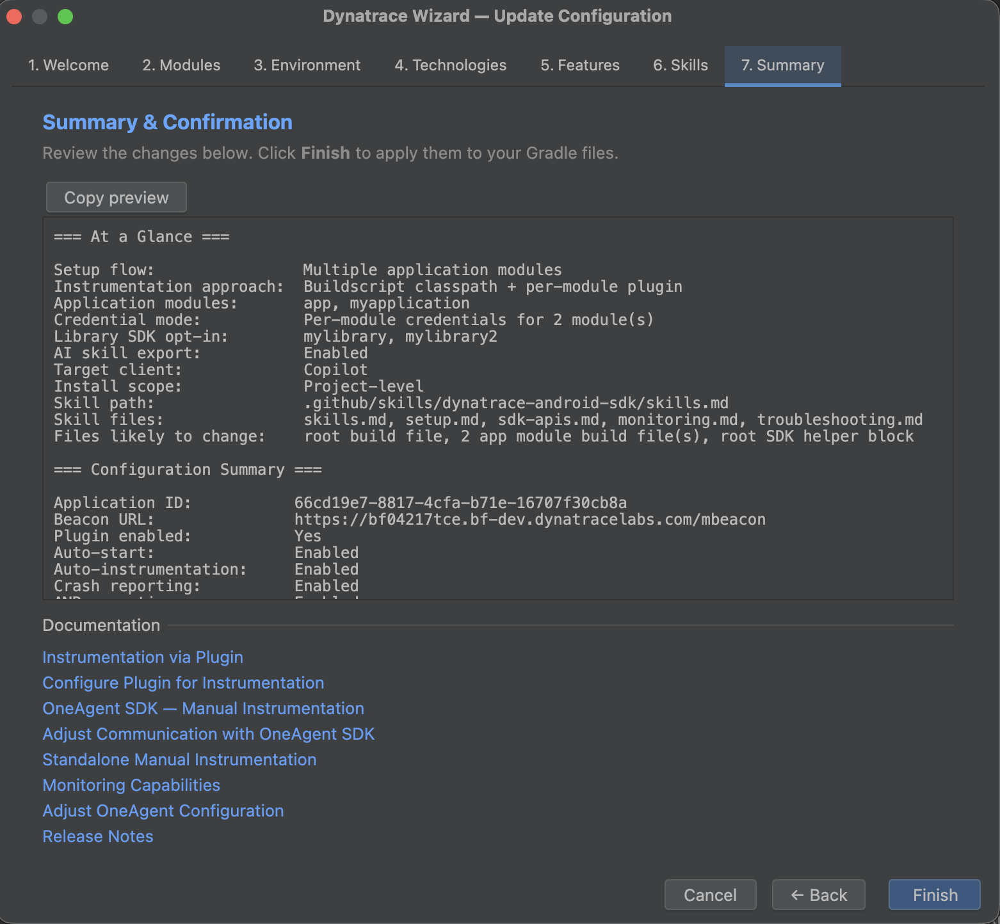

# Dynatrace Wizard

An **Android Studio / IntelliJ IDEA** plugin that
simplifies [Dynatrace Mobile SDK](https://docs.dynatrace.com/docs/observe/digital-experience/mobile-applications/instrument-android-app/instrumentation-via-plugin)
configuration for Android projects through a guided, multi-step wizard dialog titled **"Configure Dynatrace Mobile SDK"**.

---

### Wizard Steps















## Features

- 🧙 **7-step wizard UI** — guided tab-based dialog; the **Modules tab is omitted** for single-app flows (only shown for multi-app or library-module projects)
- 📊 **Step progress bar** — custom-painted horizontal indicator above the tab pane; numbered circles show completed / current / future state and are clickable for direct navigation
- 🔒 **Forward-navigation guard** — clicking a tab header directly cannot bypass required fields; attempting to skip past an unfilled Environment or Modules tab redirects with an inline error
- ⚡ **Finish always accessible** — the Finish button is visible on every tab so users can apply defaults and close at any point; validation still runs and redirects to the first invalid tab if needed
- 🔍 **Auto project detection** — detects Android projects, locates `build.gradle(.kts)` files, and classifies every module automatically
- 🏗️ **Multi-module support** — handles single-app, feature-module, and multi-app projects with appropriate instrumentation strategies per setup flow
- 🔀 **Two plugin approaches** — Plugin DSL (`plugins {}` block) and buildscript classpath (`buildscript { dependencies { classpath } }`) with seamless migration between them
- 🔑 **Per-module credentials** — for multi-app projects using the per-module approach, each app module can have its own Application ID and Beacon URL
- 🔄 **Update / re-run mode** — when Dynatrace is already configured the wizard pre-fills all fields from the existing setup, including per-module credentials
- 🧩 **Legacy mixed Kotlin DSL support** — supports projects using both `plugins {}` and `buildscript { classpath }`, and emits `apply(plugin = "com.dynatrace.instrumentation")` + `configure<com.dynatrace.tools.android.dsl.DynatraceExtension> {}` when needed
- 🔬 **Technology compatibility scan** — detects 20+ libraries and frameworks in the project and reports Dynatrace compatibility against known version ranges
- 🔍 **Feature search + Recommended/Advanced toggle** — live filter bar on the Features tab; 8 core rows visible by default; 12 advanced rows revealed on demand; search overrides the mode filter
- ✏️ **Gradle file modification** — adds the Dynatrace Gradle plugin and `dynatrace {}` configuration block with correct placement and deduplication
- 🧹 **Approach migration** — switches cleanly between Plugin DSL and per-module by removing stale coordinator declarations, classpath entries, and orphaned `dynatrace {}` blocks
- 🔀 **Groovy & Kotlin DSL support** — handles both `build.gradle` and `build.gradle.kts`
- ✅ **Input validation** — real-time validation for Application ID and Beacon URL (with per-module field support)
- 📋 **Diff-style change preview** — the Summary tab shows per-file change cards with `+` prefixed generated code before anything is written; secondary details are collapsed behind a toggle
- 🤖 **AI skill export** — optional Markdown skill-set export (5 files) from a dedicated Skills tab; collapsed to a single opt-in checkbox by default with a plain-English description
- 🔔 **IDE notifications** — success and error notifications via IntelliJ's notification system
- ↩️ **Undo support** — all Gradle file writes use `WriteCommandAction` and can be undone with Ctrl/Cmd+Z

---

## Wizard Steps

| # | Tab              | Description                                                                                                                                                   |
|---|------------------|---------------------------------------------------------------------------------------------------------------------------------------------------------------|
| 1 | **Welcome**      | Detects the Android project; shows module list, plugin approach, setup flow, and mavenCentral() status                                                        |
| 2 | **Modules** ¹    | Select which app modules to instrument; choose Plugin DSL vs per-module approach for multi-app projects; opt library modules into the OneAgent SDK dependency |
| 3 | **Technologies** | Scans the project for 20+ libraries and shows Dynatrace compatibility status with detected version numbers                                                    |
| 4 | **Environment**  | Enter Dynatrace **Application ID** and **Beacon URL**; "New to Dynatrace?" link for first-time customers; per-module credential toggle for multi-app projects |
| 5 | **Features**     | Recommended instrumentation toggles shown by default; Advanced toggle reveals 12 additional options; live search always overrides the mode filter             |
| 6 | **Skills**       | Opt-in checkbox to export a reusable AI skill file; collapsed by default — expands to show client, scope, and path options when checked                       |
| 7 | **Summary**      | Per-file diff cards (`+` prefixed code blocks, action bullets); warnings and startup snippet shown inline; configuration details collapsible                  |

¹ The Modules tab is only shown for **multi-app** projects or projects with **library modules** that can opt into the
OneAgent SDK. Single-app and feature-module projects skip it — the module summary on the Welcome tab is sufficient.

---

## Setup Flows

The wizard detects the project structure and routes configuration accordingly:

| Flow                  | When detected                                 | Strategy                                                                                                                                                                     |
|-----------------------|-----------------------------------------------|------------------------------------------------------------------------------------------------------------------------------------------------------------------------------|
| **Single app**        | One `com.android.application` module          | Plugin DSL or classpath at root; `dynatrace {}` block in root (Plugin DSL) or app module (classpath)                                                                         |
| **Feature modules**   | Base app + dynamic-feature modules            | Same as single app; feature and library modules are instrumented automatically — no per-module changes needed                                                                |
| **Multi-app**         | Two or more `com.android.application` modules | **Plugin DSL**: coordinator at root instruments all app modules automatically. **Per-module**: classpath at root + `com.dynatrace.instrumentation.module` in each app module |
| **Single build file** | Root file also acts as the app module         | All changes applied to the single root build file                                                                                                                            |
| **Unknown**           | Structure unclear                             | Best-effort single-app treatment                                                                                                                                             |

### Plugin Approach Migration

When switching approaches on a re-run:

- **Per-module → Plugin DSL**: removes the classpath entry from `buildscript {}`, removes `dynatrace {}` blocks from
  each app module, and adds the coordinator plugin + root `dynatrace {}` block.
- **Plugin DSL → Per-module**: removes the coordinator plugin declaration and root `dynatrace {}` block, adds the
  classpath entry to `buildscript {}`, and adds `com.dynatrace.instrumentation.module` + `dynatrace {}` to each app
  module.

> **Mixed state detected**: when both a `plugins {}` block and a `buildscript { classpath }` entry are found, the
> wizard keeps the classpath approach and configures Kotlin DSL roots using
> `apply(plugin = "com.dynatrace.instrumentation")` +
> `configure<com.dynatrace.tools.android.dsl.DynatraceExtension> {}`.

---

## Environment Tab — Per-Module Credentials

For **multi-app + per-module** projects, check **"Configure each app module individually"** to enter a separate
Application ID and Beacon URL for each app module. When unchecked (default), all modules share the same credentials.

On re-open, per-module credentials are read back from each module's build file and pre-filled automatically, and the
toggle switches to individual mode.

---

## Features Tab

Use the **search bar** at the top of the tab to filter toggles by name or keyword (e.g. type `gdpr` to jump straight to the opt-in toggle, or `crash` to find crash reporting options). Sections with no matching rows collapse automatically.

The tab opens in **Recommended mode** showing 8 core rows. Click **▼ Show advanced settings** to reveal all 20 options. The search bar always overrides the current mode — typing finds any row regardless of whether it is in the core or advanced group.

| Mode        | Rows shown                                                                                      |
|-------------|-------------------------------------------------------------------------------------------------|
| Recommended | Auto-instrument, auto-start, user actions, web requests, lifecycle, crash, ANR, user opt-in     |
| Advanced    | All of the above + plugin enabled, native crash, Compose, rage tap, name privacy, location, hybrid WebView, load balancing, Grail, strict mode, Session Replay, agent logging |

| Section                  | Options                                                                                       |
|--------------------------|-----------------------------------------------------------------------------------------------|
| **Global**               | Plugin enabled (global kill-switch for all instrumentation)                                   |
| **Instrumentation**      | Auto-instrumentation (bytecode transform), auto-start on app launch                           |
| **Monitoring**           | User actions, web requests (OkHttp / HttpURLConnection), lifecycle, crash reporting           |
| **Compose & Behavioral** | Jetpack Compose instrumentation, rage tap detection, Session Replay                           |
| **Privacy**              | User opt-in mode (GDPR), name privacy masking, location monitoring, hybrid WebView monitoring |
| **Advanced**             | Client-side ActiveGate load balancing, New RUM Experience (Grail), strict mode                |
| **Exclusions**           | Exclude packages / classes / methods from bytecode transformation (comma-separated)           |
| **Build variant**        | Restrict instrumentation to a specific Gradle build variant (regex)                           |

---

## Skills Tab

### AI Skill Export

The Skills tab opens with a single **"Export AI skill file"** checkbox and a plain-English description:

> *If you use an AI coding assistant (GitHub Copilot, Claude, Cursor, etc.), checking this option exports documentation
> files that teach your assistant about the Dynatrace SDK — so it can suggest the right APIs without extra prompting.
> **Skip this if you don't use AI coding tools.***

Checking the box reveals the full configuration: **Target client**, **Install scope**, **Output path**, and a
**Detected Skills** section that scans the target directory and shows how many of the 5 files are already installed.
If existing skill files are found on open, the checkbox is auto-checked and the panel expands immediately.

When **Export AI skill file** is enabled and you click **Finish**, the wizard writes **5 Markdown files**:

| File | Content |
|------|---------|
| `skills.md` | Project-specific index — your app modules, credentials, selected features, and generated Gradle blocks |
| `setup.md` | Full plugin setup & configuration reference (DSL snippets, multi-module patterns, manual startup) |
| `sdk-apis.md` | OneAgent SDK API reference (user actions, business events, web request timing, hybrid monitoring) |
| `monitoring.md` | Monitoring features reference (web requests, crash/ANR, W3C Trace Context, custom events) |
| `troubleshooting.md` | Troubleshooting guide (build errors, runtime Q&A, instrumentation limitations) |

All five files are written to the same directory. The default target depends on the selected AI client and install scope.

`skills.md` includes:

- frontmatter metadata and invocation guidance
- target app modules and selected Dynatrace features
- generated `dynatrace {}` block for both Kotlin and Groovy DSL
- a quick-reference install-location table for supported AI clients
- project/module context captured from the wizard, including excluded modules and optional OneAgent SDK targets

User-level = available to all projects; project-level = repository-only.

| Client | User-level path | Project-level path |
| --- | --- | --- |
| Claude Code | `~/.claude/skills/` | `.claude/skills/` |
| Codex | `~/.codex/skills/` | `.codex/skills/` |
| Copilot | `~/.copilot/skills/` | `.github/skills/` |
| Cursor | `~/.cursor/skills/` | `.cursor/skills/` |
| OpenCode | `~/.config/opencode/skill/` | `.opencode/skill/` |
| AmpCode | `~/.config/agents/skills/` | `.agents/skills/` |

The files are generated / copied **on the fly** when you click **Finish** in the wizard and written directly into your Android project.

The canonical reference skills — covering all setup flows, DSLs, and features — ship with the plugin under [`docs/skills/`](docs/skills/). They can be installed manually into any supported AI client without running the wizard.

---

## Technology Compatibility

The **Technologies tab** scans all Gradle build files, `libs.versions.toml`, and `gradle-wrapper.properties` and reports
compatibility status for:

| Category           | Technologies                                                                       |
|--------------------|------------------------------------------------------------------------------------|
| Build & Toolchain  | Android Gradle Plugin (8.0+), Kotlin (1.8–2.3 — probably no issues in this range), Gradle Wrapper, Android SDK API level |
| HTTP & Networking  | HttpURLConnection, OkHttp (v3+), Retrofit 2, Apache HTTP Client                    |
| Jetpack & UI       | Jetpack Compose (1.4–1.10), Android Views / Activities                             |
| Async              | Kotlin Coroutines (1.10.2–2.1)                                                     |
| Crash & Exceptions | Java / Kotlin uncaught exceptions                                                  |
| Hybrid             | Android WebView                                                                    |
| Behavioral         | Rage tap detection                                                                 |
| Privacy            | Opt-in mode, name privacy masking                                                  |

Each entry shows one of:

- ✅ **Compatible** — detected and within the supported version range
- ⚠️ **Likely compatible** — detected, within the range, but Dynatrace has not yet published explicit support for the exact version; instrumentation should work without issues
- ❌ **Unsupported version** — detected but outside the supported range
- 💡 **Not in project** — library not found; no action required
- 🔷 **Built-in / Informational** — always available; detected version shown for reference

---

## Compatibility

| IDE                                  | Minimum Version  |
|--------------------------------------|------------------|
| IntelliJ IDEA (Community / Ultimate) | 2024.1           |
| Android Studio                       | 2025.1 (Meerkat) |

- Uses the modern `guessProjectDir()` API — the deprecated `project.baseDir` is not used.
- Supports **Kotlin DSL** (`build.gradle.kts`) and **Groovy DSL** (`build.gradle`).
- Supports **Version Catalogs** — recognises `alias(libs.plugins.android.application)` and other catalog-based plugin
  declarations.

---

## Android Project Detection

The wizard scans subdirectory build files for any of the following patterns:

| Pattern                                   | Description                         |
|-------------------------------------------|-------------------------------------|
| `com.android.application`                 | Standard Android application plugin |
| `com.android.library`                     | Android library module              |
| `com.android.dynamic-feature`             | Dynamic feature module              |
| `com.android.test`                        | Android test module                 |
| `android { }` block                       | Gradle `android` extension          |
| `androidApplication()`                    | Version Catalog Kotlin DSL alias    |
| `android.application` / `android.library` | Dot-notation catalog aliases        |

---

## Installation

### From JetBrains Marketplace _(coming soon)_

1. Open Android Studio / IntelliJ IDEA
2. Go to **Settings → Plugins → Marketplace**
3. Search for **Dynatrace Wizard**
4. Click **Install** and restart the IDE

### From Source

See [Build & Run from Source](#build--run-from-source) below.

---

## Usage

1. Open an Android project in Android Studio or IntelliJ IDEA
2. Go to **Tools → Dynatrace Wizard…**  
   _(or right-click in the Project view / Editor → Dynatrace Wizard…)_
3. Follow the wizard steps:
    - **Welcome** — verify project and module detection
    - **Modules** *(multi-app / library modules only)* — select modules and instrumentation approach
    - **Technologies** — review compatibility of detected libraries before entering credentials
    - **Environment** — enter Application ID + Beacon URL; first-time customers see a "Create your first mobile app" link
    - **Features** — configure instrumentation options (Recommended view by default; toggle Advanced for more)
    - **Skills** — optionally export a reusable AI skill file (collapsed by default; check to expand)
    - **Summary** — review per-file change cards and click **Finish** (or click **Finish** from any earlier tab to apply defaults)
4. **Sync** your Gradle project to activate the Dynatrace agent

> If Dynatrace is already configured the wizard detects it, asks whether to update the existing setup, and pre-fills all
> fields — including per-module credentials — from the current build files.

### Where to Find Your Dynatrace Credentials

**If you already have a Dynatrace mobile app:**

1. Log in to your Dynatrace environment
2. Navigate to **Mobile → (your app) → Settings → Instrumentation**
3. Copy the **Application ID** and **Beacon URL**

**If you are new to Dynatrace and don't have a mobile app yet:**

Use the **"New to Dynatrace? Create your first mobile app in the portal →"** link on the Environment tab, or go to
[Instrument an Android app](https://docs.dynatrace.com/docs/observe/digital-experience/mobile-applications/instrument-android-app)
in the Dynatrace documentation — this page walks you through creating a new mobile application and obtaining the
credentials needed to fill in this tab.

---

## Build & Run from Source

### Prerequisites

- JDK 17 or newer
- IntelliJ IDEA (any edition) or Android Studio

### Steps

```bash
# Clone the repository
git clone https://github.com/HlebMaliborski/dynatrace-mobile-wizard.git
cd dynatrace_wizard

# Build the plugin
./gradlew buildPlugin

# Run in a sandboxed IDE instance
./gradlew runIde

# Run unit tests
./gradlew test
```

The built plugin `.zip` is placed in `build/distributions/`.

To install manually:

1. **Settings → Plugins → ⚙ → Install Plugin from Disk…**
2. Select the generated `.zip` file

---

## Project Structure

```
dynatrace_wizard/
├── build.gradle.kts
├── settings.gradle.kts
├── gradle.properties                          # Plugin metadata & target IDE version
├── CHANGELOG.md
└── src/main/
    ├── kotlin/com/dynatrace/wizard/
    │   ├── DynatraceWizardAction.kt           # Action (Tools menu / context menu)
    │   ├── wizard/
    │   │   ├── DynatraceWizardDialog.kt       # Tab wizard dialog + navigation + step-bar wiring
    │   │   ├── WizardStepBar.kt               # Custom-painted horizontal step progress indicator
    │   │   ├── WelcomeStep.kt                 # Tab 1: project detection overview
    │   │   ├── ModuleSelectionStep.kt         # Tab 2: module selection + approach toggle (multi-app only)
    │   │   ├── SupportedTechnologiesStep.kt   # Tab 3: technology compatibility scan
    │   │   ├── EnvironmentConfigStep.kt       # Tab 4: App ID + Beacon URL (per-module support)
    │   │   ├── FeatureToggleStep.kt           # Tab 5: instrumentation toggles (Recommended/Advanced + search)
    │   │   ├── SkillsStep.kt                  # Tab 6: AI skill export (collapsed opt-in; client/scope/path)
    │   │   └── SummaryStep.kt                 # Tab 7: diff-style change cards + collapsible details
    │   ├── model/
    │   │   └── DynatraceConfig.kt             # Configuration data model (incl. ModuleCredentials)
    │   ├── service/
    │   │   ├── GradleModificationService.kt   # Gradle file codegen + approach migration
    │   │   └── ProjectDetectionService.kt     # Project structure + module type detection
    │   └── util/
    │       ├── ValidationUtil.kt              # App ID + Beacon URL validation
    │       ├── DocumentationLinks.kt          # Dynatrace docs URL constants
    │       └── WizardColors.kt                # Shared UI color palette
    └── resources/META-INF/
        ├── plugin.xml                         # Plugin descriptor + action registrations
        └── pluginIcon.svg
```

---

## Contributing

Contributions are welcome! Please:

1. Fork the repository
2. Create a feature branch: `git checkout -b feature/my-feature`
3. Commit your changes: `git commit -m "Add my feature"`
4. Push and open a Pull Request

### Code Style

- Kotlin with standard JetBrains conventions
- All IDE interactions use IntelliJ Platform APIs (`VirtualFile`, `WriteCommandAction`, `NotificationGroupManager`)
- New wizard steps: add a `*Step.kt` in `wizard/`, implement `createPanel()`, register in `DynatraceWizardDialog`
- New config options: add a field to `DynatraceConfig`, expose from the relevant step, update `buildConfig()`, and add
  codegen in both `buildDynatraceBlockKts()` and `buildDynatraceBlockGroovy()`
- Tests live under `src/test/` and use JUnit 4

---

## License

This project is licensed under the **Apache License 2.0**.  
See [LICENSE](LICENSE) for details.

---

## Acknowledgements

- [IntelliJ Platform Plugin SDK](https://plugins.jetbrains.com/docs/intellij/welcome.html)
- [Dynatrace Android Instrumentation Documentation](https://docs.dynatrace.com/docs/observe/digital-experience/mobile-applications/instrument-android-app/instrumentation-via-plugin)
